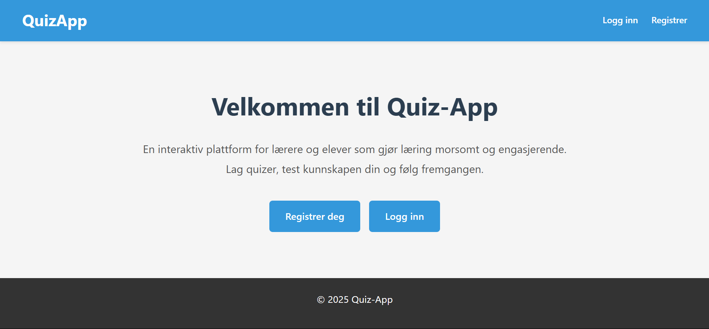
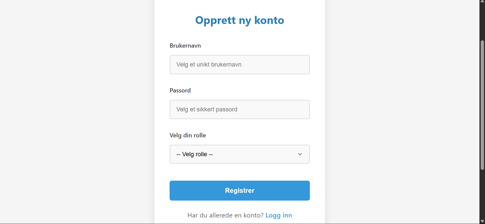
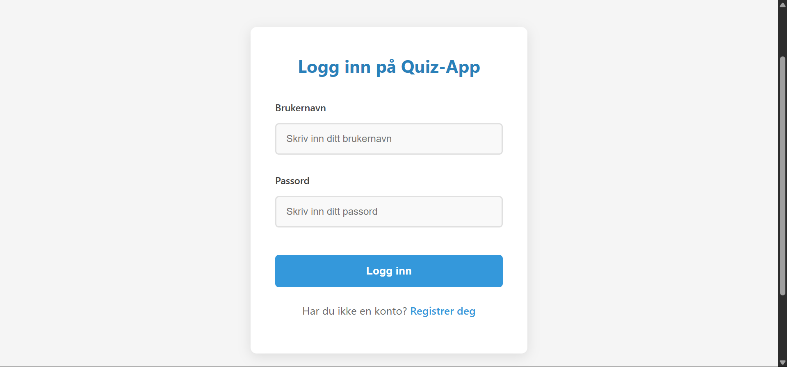
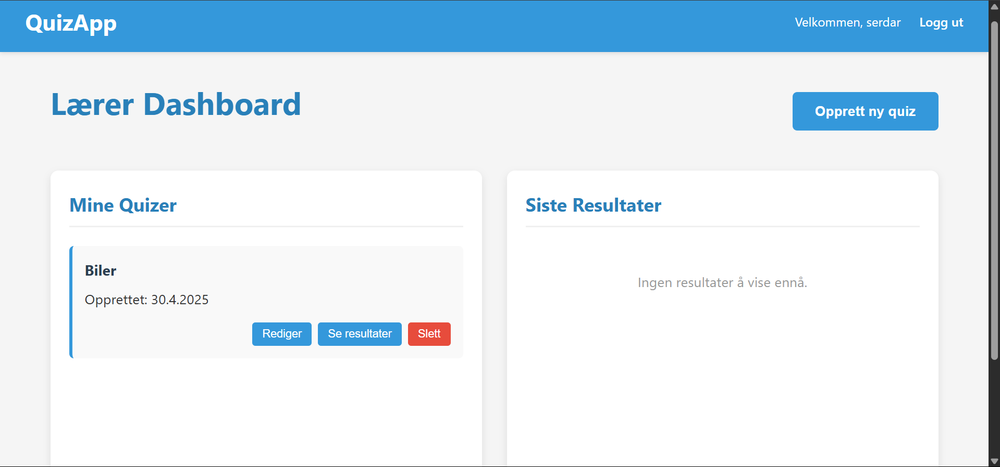
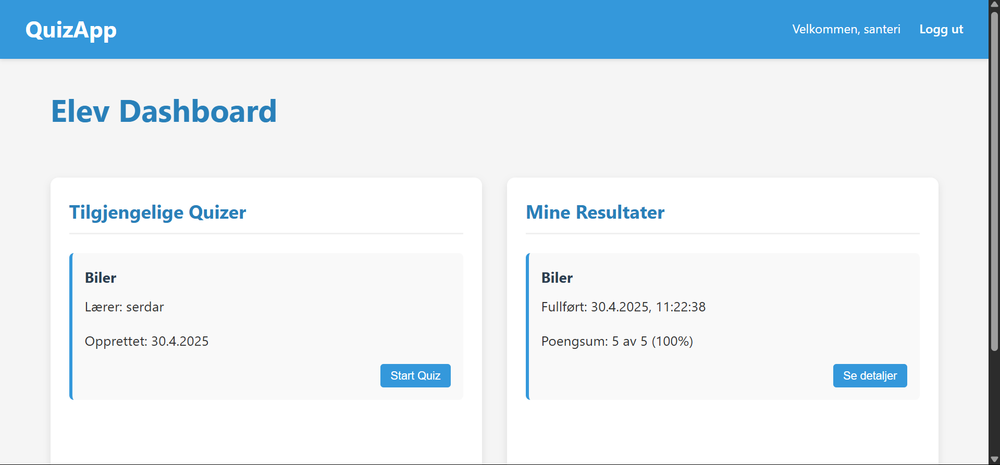

Quiz-App for Skoler
En interaktiv quiz-applikasjon laget for bruk i skoler, der lærere kan opprette prøver og elever kan gjennomføre dem. Resultatene lagres i en database, og lærere kan se elevenes besvarelser.

Funksjonalitet
For lærere:
Opprette quizer med flervalgsoppgaver
Legge til spørsmål med ett riktig svar og tre gale svar
Se oversikt over alle quizer
Se detaljerte resultater og statistikk for hver quiz
Se hvilke spørsmål elevene svarer riktig og feil på
For elever:
Se oversikt over tilgjengelige quizer
Gjennomføre quizer med umiddelbar tilbakemelding
Se egne resultater og historikk
Se detaljert gjennomgang av egne svar
Teknologier brukt
Frontend: HTML, CSS, JavaScript
Backend: Node.js med Express
Database: MySQL
Autentisering: bcrypt for passordhashing, Express Session for sesjonshåndtering
Installasjon
Forutsetninger
Node.js (versjon 14 eller nyere)
MySQL (versjon 8 eller nyere)
Steg 1: Klon prosjektet
bash
git clone <prosjektets-github-url>
cd quiz-app
Steg 2: Installer avhengigheter
bash
npm install
Steg 3: Sett opp databasen
Opprett en MySQL-database kalt "quizapp"
Kjør SQL-skriptet i config/database.sql for å opprette tabellene:
bash
mysql -u <brukernavn> -p quizapp < config/database.sql
Steg 4: Konfigurer databasetilkobling
Åpne filen config/db.js og endre tilkoblingsinformasjonen:

javascript
const pool = mysql.createPool({
  host: 'localhost',     // Endre hvis databasen er på en annen server
  user: 'root',          // Endre til din MySQL-bruker
  password: '',          // Endre til ditt MySQL-passord
  database: 'quizapp'
});
Steg 5: Start serveren
bash
node server.js
Applikasjonen kjører nå på http://localhost:3000

Mappestruktur
quiz-app/
│
├── public/              # Statiske filer (HTML, CSS, klient-side JavaScript)
│   ├── css/             # CSS-stilark
│   ├── js/              # Klient-side JavaScript
│   ├── images/          # Bilder
│   ├── teacher/         # Lærer-spesifikke sider
│   └── student/         # Elev-spesifikke sider
│
├── routes/              # API-ruter
│
├── controllers/         # Håndterer logikk for rutene
│
├── models/              # Databasemodeller
│
├── middleware/          # Middleware-funksjoner (f.eks. autentisering)
│
├── config/              # Konfigurasjonsfiler
│
├── server.js            # Hovedfilen som starter serveren
│
└── package.json         # Prosjektinformasjon og avhengigheter
API-endepunkter
Autentisering
POST /api/register - Registrer ny bruker
POST /api/login - Logg inn
POST /api/logout - Logg ut
GET /api/user - Hent nåværende innlogget bruker
Quizer (Lærer)
POST /api/quizzes - Opprett ny quiz
GET /api/teacher/quizzes - Hent alle quizer for innlogget lærer
DELETE /api/quizzes/:id - Slett en quiz
POST /api/quizzes/:id/questions - Legg til spørsmål i en quiz
DELETE /api/questions/:id - Slett et spørsmål
GET /api/teacher/quizzes/:id/submissions - Hent alle besvarelser for en quiz
Quizer (Elev)
GET /api/quizzes - Hent alle tilgjengelige quizer
GET /api/quizzes/:id - Hent en quiz med spørsmål
POST /api/submissions - Start en ny besvarelse
POST /api/submissions/answer - Lagre svar på et spørsmål
POST /api/submissions/result - Lagre resultat for en besvarelse
GET /api/submissions/:id - Hent detaljer for en besvarelse
GET /api/student/results - Hent alle resultater for innlogget elev
Bruk
Registrer en lærerkonto og en elevkonto
Logg inn som lærer for å opprette quizer og legge til spørsmål
Logg inn som elev for å ta quizene og se resultater
Sikkerhet
Passord lagres med bcrypt-hashing
Rollebasert autentisering sikrer at bare lærere kan opprette og administrere quizer
Sesjonshåndtering med Express Session
Bidrag
Bidrag til prosjektet er velkommen! For å bidra:

Fork repositoriet
Opprett en feature branch (git checkout -b feature/min-nye-funksjon)
Commit endringene dine (git commit -m 'Lagt til min nye funksjon')
Push til branch (git push origin feature/min-nye-funksjon)
Åpne en Pull Request

Kontakt
[santeriwille@gmail.com]

Resultat

